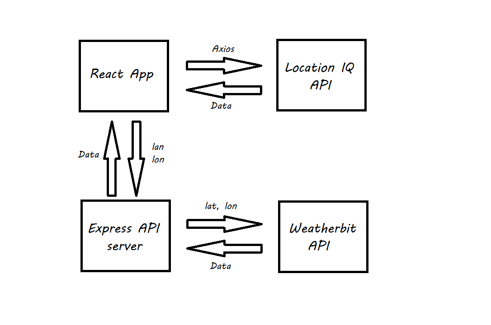

# city explorer

## React application that uses the Axios library to make user-initiated reqeusts for data from a thrid-party API.

## Lab06: Asynchronous code, and APIs

partner: Sufian Hamdan
### Inputs for the location data: 
1. GET Request: URL
2. Key: API key
3. q: data

### Inputs for the static map data: 
1. GET Request: URL
2. Key: API key
3. lat: data
4. lon: data

### Functions:
* Function that get the data from the user based on the location name then we pass the location name inside the url.
* Function that target the value that the user entered then pass it to the functiom that sends the GET Request URL.

### WRRC :

## Lab07: Custom Servers with Node and Express

partner: Ahmad Ammoura
### Inputs for the weather data: 
1. GET Request: URL
2. Key: API key
3. q: data

### outputs:
1. static weather data

### Functions:
* Function that get the data from the user based on the location name then we pass the location name inside the url.
* Function that target the value that the user entered then pass it to the functiom that sends the GET Request URL.

### WRRC :

## Lab07: API's

partner: Mohammad Aqel
### Inputs for the weather/movies data: 
1. GET Request: URL
2. Key: API key
3. q: data

### outputs: 
1. live weather data
2. movies list

### Functions:
* Function that get the data from the user based on the location name, lat,lon then we pass them inside the url.
* Function that target the value that the user entered then pass it to the functiom that sends the GET Request URL.

### WRRC :

### Time Estimates:

#### Name of feature: Displaying ACP map

Estimate of time needed to complete: 2 hours

Start time: 11:30 PM

Finish time: 2:00 AM

Actual time needed to complete: 2 hours 30 minuets

#### Name of feature: Displaying weather information from static data

Estimate of time needed to complete: 2 hours

Start time: 3:00 PM 

Finish time: 6:00 PM

Actual time needed to complete: 3 hours

#### Name of feature: Displaying live weather information

Estimate of time needed to complete: 2 hours

Start time: 3:00 PM 

Finish time: 5:00 PM

Actual time needed to complete: 2 hours

#### Name of feature: Displaying Movies information

Estimate of time needed to complete: 2 hours

Start time: 3:00 PM 

Finish time: 5:30 PM

Actual time needed to complete: 2 hours 30 minuets 