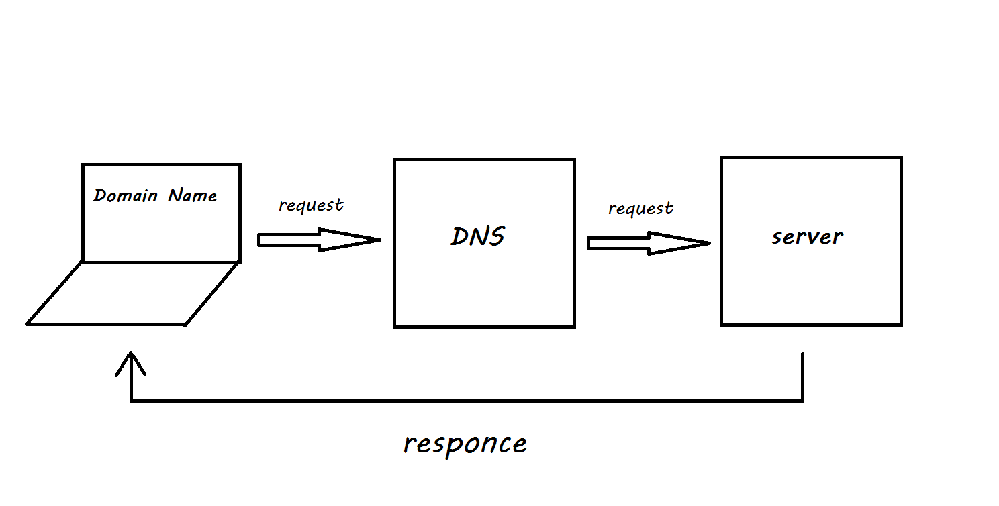

# city explorer

## React application that uses the Axios library to make user-initiated reqeusts for data from a thrid-party API.

### Inputs for the location data: 
1. GET Request: URL
2. Key: API key
3. q: data

### Inputs for the static map data: 
1. GET Request: URL
2. Key: API key
3. lat: data
4. lon: data

### Functions:
* Function that get the data from the user based on the location name then we pass the location name inside the url.
* Function that target the value that the user entered then pass it to the functiom that sends the GET Request URL.

### WRRC :

### Time Estimates:

Name of feature: Displaying ACP map

Estimate of time needed to complete: 2 hours

Start time: 11:30 PM

Finish time: 2:00 AM

Actual time needed to complete: 2 hours 30 minuets

